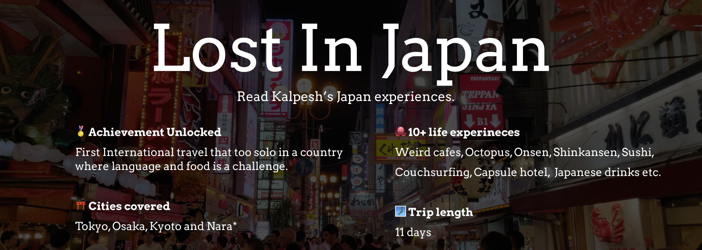

# Lost In Japan

Welcome to the Lost In Japan codebase.

I bet you must have checked out the [Lost In Japan](https://lost-in-japan.guide) website and being a nerd you want to help me to fix and improve the codebase. I appreciate this fact and welcome your compliments or criticism on the codebase.

The goal was to keep consistency and best practices in the codebase but over time you lose interest and just code. That might be the story of this codebase too.

**Quick things:**
- Built with Gatsby
- Uses CSS Grid (my first project using Grid)
- BEM naming convention

No formal guideline for PR is defined, feel free to submit to fix layout issue, best practice in JS and CSS, grammar or spelling errors, performance, optimization or security. 

Feel free to connect on Twitter [@knowkalpesh](https://twitter.com/knowkalpesh) to ask more about Lost In Japan.
